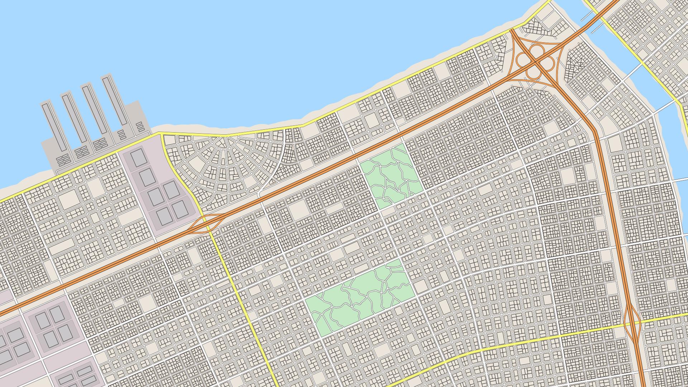
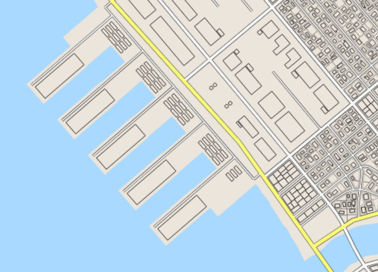
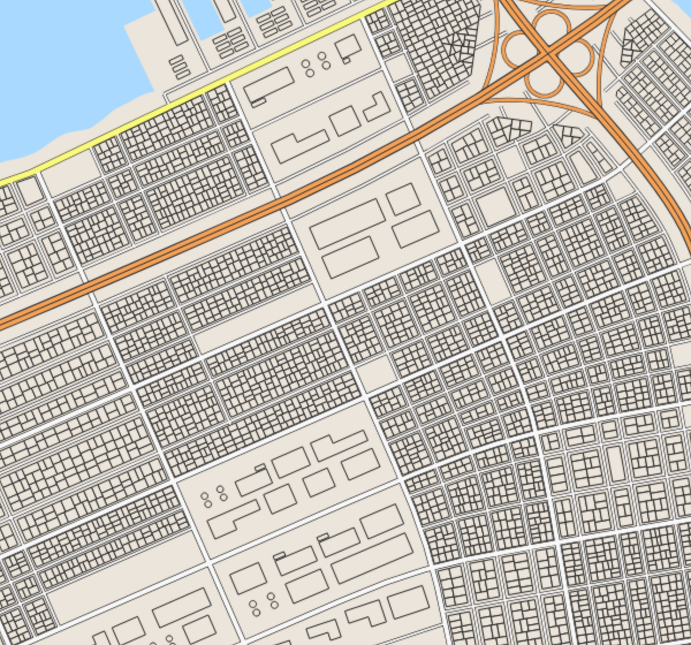
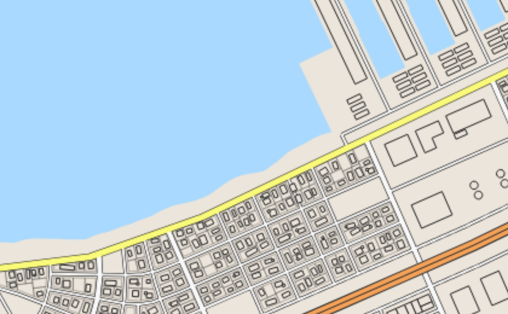
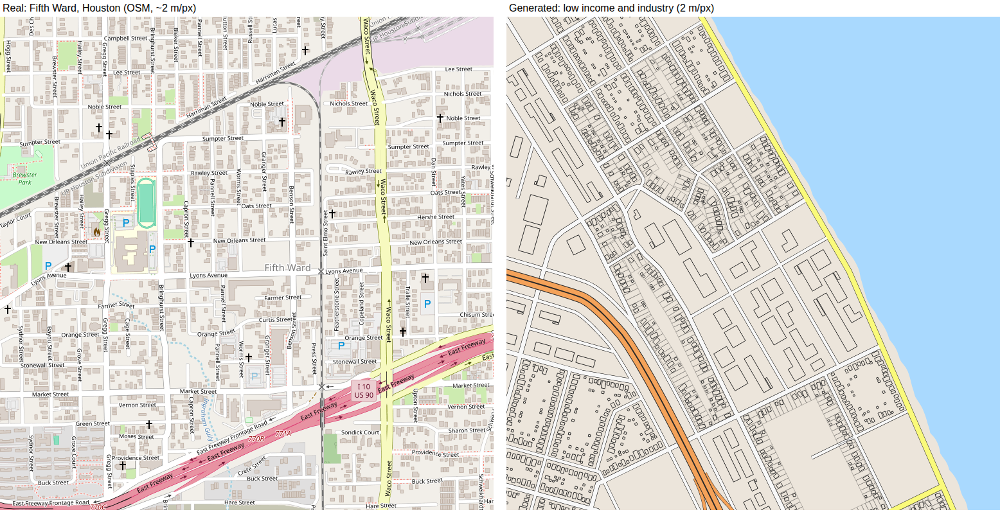
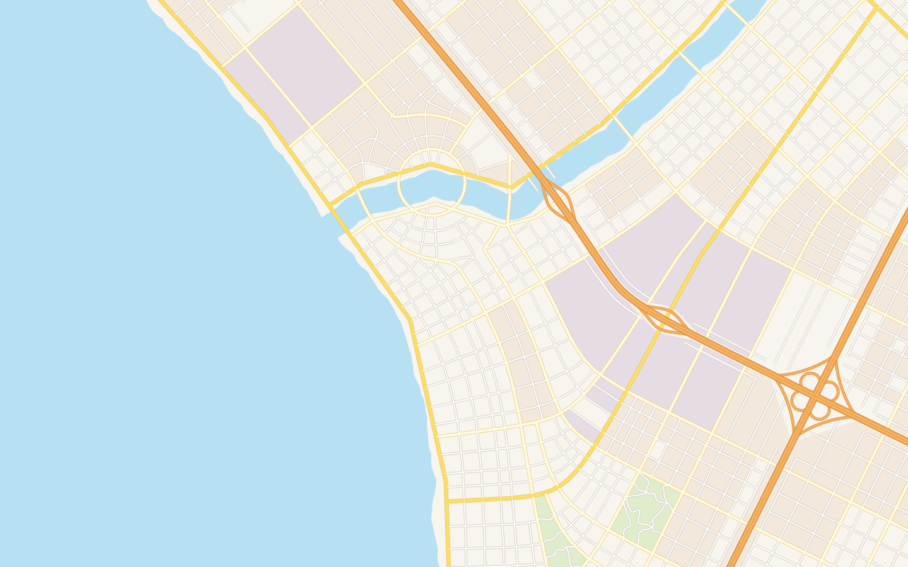

> **This is a fork** of [ProbableTrain/MapGenerator](https://github.com/ProbableTrain/MapGenerator), maintained as **map-maker**.
> All credit for the original work goes to ProbableTrain and its contributors. Licensed under LGPL-3.0 (see `COPYING` and `COPYING.LESSER`).
>
> See [What's new in map-maker](#whats-new-in-map-maker) for the changes made in this fork.


<!-- ALL-CONTRIBUTORS-BADGE:START - Do not remove or modify this section -->
[](#contributors-)
<!-- ALL-CONTRIBUTORS-BADGE:END -->

<br />
<p align="center">
  <a href="https://github.com/probabletrain/mapgenerator">
      
  </a>

  <h3 align="center">Map Generator</h3>

  <p align="center">
    Create procedural American-style cities
    <br />
    <a href="https://probabletrain.itch.io/city-generator"><strong>Open Generator »</strong></a>
    <br />
    <br />
    <a href="https://maps.probabletrain.com" target="_blank">Read the Docs</a>
    ·
    <a href="https://github.com/probabletrain/mapgenerator/issues">Report Bug</a>
    ·
    <a href="https://github.com/probabletrain/mapgenerator/issues">Request Feature</a>
  </p>
</p>


## Table of Contents

* [What's new in map-maker](#whats-new-in-map-maker)
* [About the Project](#about-the-project)
  * [Built With](#built-with)
* [Getting Started](#getting-started)
  * [Prerequisites](#prerequisites)
  * [Installation](#installation)
* [Usage](#usage)
* [Roadmap](#roadmap)
* [Contributing](#contributing)
* [License](#license)
* [Contact](#contact)


## What's new in map-maker



Highways, industry and low income neighbourhoods are generated together, because in real cities each one shapes the others:

* **Highways** (Map → Highways): one to four long, smooth expressways cross the whole map. They follow the city's tensor field, so they line up with the street grid, and they bridge rivers.
  * **Interchanges**: diamond interchanges where main roads cross a highway, cloverleafs where two highways cross. Slip roads leave the carriageway at a shallow angle and follow its curve. With frontage roads they merge into the frontage road, which carries on through the interchange to a junction with the crossroad (Texas style); without, they run alongside the highway to junctions on the crossroad. Other roads pass under or over the highway.
  * **Frontage roads** run alongside highways. Side streets end at the frontage road, and no buildings go in the verge between them. Where streets on both sides line up, some carry on under the highway, as the street grid does under real urban freeways.
* **Industry** (Map → Zoning): industrial districts are placed at highway interchanges, well away from the water. They are superblocks bounded by main and major roads with no residential side streets; instead each block gets its own service roads, so every lot fronts a road. Lots sit on a common grid but vary in width, are set back from the road, and hold one or two sheds of a few shapes (plain, L shaped, with a front office, twin sheds) behind a lorry yard with space all round. A few lots are tank farms. Parks are never placed in industrial districts.
* **Ports**: waterfront land is too valuable to waste on anything but a port, so some maps (`portChance`) get a port on a straight stretch of coast instead of waterfront industry. It has reclaimed quay land, slips cut back into the quay, piers of identical length each with a road and transit shed, a quay road and a container yard.




* **Low income neighbourhoods** sit on one side of the main freeway, the side with the industry: the freeway divides the city. They surround the industry and run in a wide band along the highway. Each house is a small, slightly crooked building in its own fenced yard, sizes and positions vary, some have a shed out back and a few lots stand empty.



* **Zoning controls**: `numIndustrialZones`, `industrialSize`, `lowIncomeAmount` and `portChance`; Buildings has `lowIncomeLotArea`, `industrialParcelWidth` and `industrialSetback`. `Regenerate` picks new industrial sites and rebuilds side streets and buildings without touching the main road network.
* **Map colours**: industry, ports and low income housing use the colour scheme's normal colours and are recognisable by their shapes. Highways have their own colour. Style → `showZones` adds an optional tint showing land use. Each colour scheme can set `highwayColour`, `highwayOutline`, `highwayWidth`, `rampWidth`, `industrialColour`, `industrialBuildingColour`, `lowIncomeColour` and `lowIncomeBuildingColour` in `src/colour_schemes.json`; anything left out is derived from the scheme's other colours.
* **Real-world scale**: 1 world unit = 2 m. Street spacing, block size, lot size and building footprints were measured from OpenStreetMap (Houston Heights, Fifth Ward and Brittmoore in Houston; Logan Square and Back of the Yards in Chicago) and the generator tuned to match:

  | | Real (OSM) | Before | Now |
  |---|---|---|---|
  | Typical block | 85-105 x 110-205 m | 46 x 66 m | 106-139 x 200-250 m |
  | House footprint (median) | 85-150 m² | 265 m², all alike | 110-160 m², varied |
  | Houses per hectare of block | 9-18 | about 30 | 7-12 |
  | Building coverage of blocks | 15-32% | 25% | 13-20% |
  | Industrial building (median) | 1,750 m² | 466 m² | 1,200 m² |

  Houses now sit in rows of lots facing the street, back yards meeting in the middle of the block, with garages and sheds out back. Building heights are realistic (about 7-12 m for houses) and exaggerated only in the pseudo-3D view.



* **Bug fixes** in the original lot generation: many blocks were left empty or turned into one giant building because block subdivision cut in the wrong place, dead ends broke block detection, and the build failed on case-sensitive file systems.




## About The Project


<!-- TODO YT video -->

This tool procedurally generates images of city maps. The process can be automated, or controlled at each stage give you finer control over the output.
3D models of generated cities can be downloaded as a `.stl`. The download is a `zip` containing multiple `.stl` files for different components of the map.
Images of generated cities can be downloaded as a `.png` or an `.svg`. There are a few choices for drawing style, ranging from colour themes similar to Google or Apple maps, to a hand-drawn sketch.


### Built With

* [Typescript](https://www.typescriptlang.org/)
* [Gulp](https://gulpjs.com/)


## Getting Started

To get a local copy up and running follow these steps.

### Prerequisites


* npm
```sh
npm install npm@latest -g
```

* Gulp
```
npm install --global gulp-cli
```

### Installation
 
1. Clone the mapgenerator
```sh
git clone https://github.com/probabletrain/mapgenerator.git
```
2. Install NPM packages
```sh
cd mapgenerator
npm install
```
3. Build. `npm run build` builds once into `dist/`. `npm start` watches for changes to any Typescript files; if you edit the HTML or CSS you will have to rerun it. [Gulp Notify](https://github.com/mikaelbr/gulp-notify) sends a notification whenever a watch build finishes.
```
npm run build
```
4. Open `dist/index.html` in a web browser, refresh the page whenever the project is rebuilt.
5. `npm run typecheck` checks the Typescript without building.


## Usage

See the [documentation](https://maps.probabletrain.com).


## Roadmap

See the [open issues](https://github.com/probabletrain/mapgenerator/issues) for a list of proposed features (and known issues).


## Contributing

Contributions are what make the open source community such an amazing place to be learn, inspire, and create. Any contributions you make are **greatly appreciated**. For major changes, please open an issue first to discuss what you would like to change.

1. Fork the Project
2. Create your Feature Branch (`git checkout -b feature/AmazingFeature`)
3. Commit your Changes (`git commit -m 'Add some AmazingFeature'`)
4. Push to the Branch (`git push origin feature/AmazingFeature`)
5. Open a Pull Request

## Contributors ✨

Thanks goes to these wonderful people ([emoji key](https://allcontributors.org/docs/en/emoji-key)):

<!-- ALL-CONTRIBUTORS-LIST:START - Do not remove or modify this section -->
<!-- prettier-ignore-start -->
<!-- markdownlint-disable -->
<table>
  <tr>
    <td align="center"><a href="https://github.com/trees-and-airlines"><br /><sub><b>trees-and-airlines</b></sub></a><br /><a href="#infra-trees-and-airlines" title="Infrastructure (Hosting, Build-Tools, etc)">🚇</a></td>
    <td align="center"><a href="https://github.com/ProbableTrain"><br /><sub><b>Keir</b></sub></a><br /><a href="https://github.com/ProbableTrain/MapGenerator/commits?author=ProbableTrain" title="Code">💻</a></td>
    <td align="center"><a href="https://github.com/ersagunkuruca"><br /><sub><b>Ersagun Kuruca</b></sub></a><br /><a href="https://github.com/ProbableTrain/MapGenerator/commits?author=ersagunkuruca" title="Code">💻</a></td>
    <td align="center"><a href="https://github.com/Jason-Patrick"><br /><sub><b>Jason-Patrick</b></sub></a><br /><a href="https://github.com/ProbableTrain/MapGenerator/commits?author=Jason-Patrick" title="Code">💻</a></td>
  </tr>
</table>

<!-- markdownlint-enable -->
<!-- prettier-ignore-end -->
<!-- ALL-CONTRIBUTORS-LIST:END -->

This project follows the [all-contributors](https://github.com/all-contributors/all-contributors) specification. Contributions of any kind welcome!


## Contact

Keir - [@probabletrain](https://twitter.com/probabletrain) - probabletrain@gmail.com

Project Link: [https://github.com/probabletrain/mapgenerator](https://github.com/probabletrain/mapgenerator)


## License

Distributed under the LGPL-3.0 License. See `COPYING` and `COPYING.LESSER` for more information.
