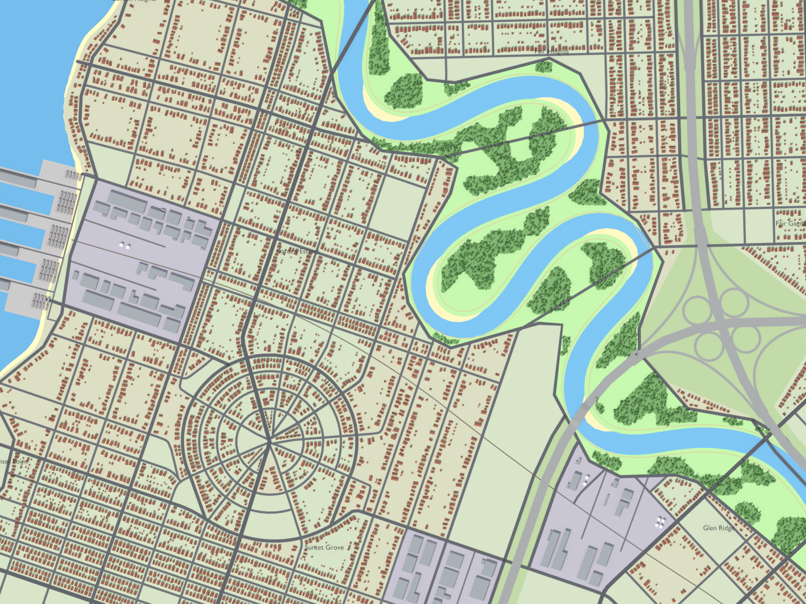
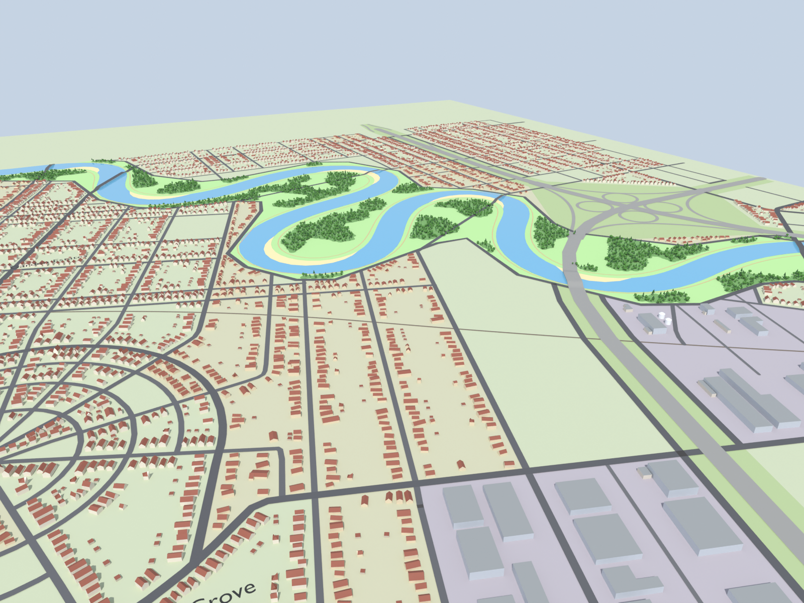

# map-maker Blender add-on

Imports a city exported by map-maker (Download → Blender) as a 3D scene built with Geometry Nodes:
extruded houses with gabled roofs, swept roads with bridges, stacked land use areas and
low-poly woods. Needs Blender 4.2 LTS or newer and nothing outside Blender's standard library.





These are renders of [`docs/blender/sample-map.geojson`](../docs/blender/sample-map.geojson), the city in
[`docs/images/osm-style-map.png`](../docs/images/osm-style-map.png).

## Install

1. Build the extension zip:

   ```sh
   python3 blender/tools/build_extension.py        # writes blender/dist/map_maker_importer-1.0.0.zip
   ```

   Or use Blender's own tool: `blender --command extension build --source-dir blender/map_maker_importer`.
2. In Blender: **Edit → Preferences → Get Extensions**, open the **⌄** menu at the top right, pick
   **Install from Disk…** and choose the zip. You can also drag the zip into the Blender window.

## Use

**File → Import → map-maker scene (.geojson)**. The sample (7,222 features) imports in under a
second. The import panel has the main knobs (height scale, road width scale, bridge height scale,
tree density) and switches for the Geometry Nodes modifiers and the label text.

The import makes a `map-maker` collection:

| object | mesh | modifier |
|---|---|---|
| `areas` | one face per area | **MM Areas**: stacks faces by `z_order`, scatters trees in `wood` |
| `roads`, `railways`, `paths` | a vertex/edge chain per line | **MM Roads** / **MM Railways** / **MM Paths**: sweeps ribbons, raises bridges |
| `buildings` | one face per footprint | **MM Buildings**: walls, gabled, flat and domed roofs |
| `waterways`, `points`, `labels` | edge chains, loose vertices | none |
| `ground` | a plane over `data_bounds` | none |
| `label text` (child collection) | flat text for neighbourhood and park labels | none |

Every modifier exposes its knobs in the modifier panel:

* **MM Buildings**: *Height Scale*.
* **MM Roads / Railways / Paths**: *Width Scale*, *Bridge Height Scale* (multiplies `deck_height`),
  *Bridge Ramp Length* (metres over which a deck eases back to the ground), *Z Offset*, *Junction Discs*.
* **MM Areas**: *Z Step* (metres per `z_order` unit), *Tree Density* (trees per m²), *Tree Scale*, *Seed*.

Each class gets a material named `MM <class>` (`MM house`, `MM motorway`, `MM wood`, ...), plus
`MM roof_gabled`, `MM roof_flat`, `MM bridge_deck`, `MM ground` and the tree materials. Edit a
material to restyle every feature of that class. Re-importing reuses existing `MM` materials.

### Attributes

Everything in the file is kept as named attributes, so you can build your own node trees:

* Polygons (`areas`, `buildings`): `class_id`, `feature_index` and every numeric property (`height`,
  `eave_height`, `levels`, `z_order`, ...) on the **FACE** domain.
* Lines and points: the same on the **POINT** domain, so they survive *Mesh to Curve*
  (`width`, `lanes`, `bridge`, `level`, `deck_height`, ...).
* String properties with a few values become INT attributes too: `roof` is 0 flat, 1 gabled, 2 dome.
  The value names are in the object's `mm_enums` custom property.
* Free text (`name`, `ref`) is kept per object in the `mm_strings` custom property, a list per
  property indexed by the `feature_index` attribute:
  `obj["mm_strings"]["name"][feature_index]`. `mm_feature_ids` holds the GeoJSON feature ids.
* The `map-maker` collection keeps the `classes` table (`mm_classes`, id → name), `mm_view_bounds`
  and `mm_data_bounds`.

The importer reads the file's `classes` table. Unknown classes, layers, properties and geometry
types import without errors: a new layer gets its own object, a new class gets a material from its
layer's colour, and new numeric properties become attributes.

## How the node trees work

* **Buildings**: footprints are extruded to `eave_height`. For gabled roofs the top is extruded
  again by `height - eave_height` and squashed flat across the ridge with *Scale Elements* (single
  axis), so the long sides become the slopes and the short sides the gable ends. The ridge direction
  comes from averaging each edge's doubled-angle vector (dx² − dy², 2·dx·dy) over the face, which
  points along the longest sides of a rectangle. Storage tanks (16-sided footprints) are cylinders
  with a low domed cap ending at `height`.
* **Lines**: *Mesh to Curve*, then each piece with `bridge = 1` rises by `deck_height` with a
  smoothstep over *Bridge Ramp Length* from each end. Pieces aren't merged, so each bridge piece
  ramps on its own and meets the ground pieces either side. Ribbons are swept with a flat profile at
  radius `width / 2`, bridge pieces get a concrete deck slab under them, and discs at line ends fill
  the gaps at junctions. Wider roads sit a few millimetres higher so they win where roads overlap.
* **Areas**: each face is lifted by `z_order × Z Step`, so higher areas cover lower ones the way the
  2D map paints them. Trees are an icosphere broadleaf and a cone conifer built in the node tree,
  scattered over `wood` faces with random size and rotation.

## Tests

```sh
python3 -m unittest discover blender/tests                     # parser, no Blender needed
blender -b --factory-startup --python blender/tests/blender_check.py   # evaluated geometry
blender -b --factory-startup --python blender/tools/render_preview.py -- \
    docs/blender/sample-map.geojson docs/images/blender-preview.png \
    --oblique docs/images/blender-preview-oblique.png --samples 24
```

The Blender scripts also run with the [`bpy` module](https://pypi.org/project/bpy/) (Python 3.11,
`pip install bpy==4.2.0`) in place of `blender -b`, which is how the previews were rendered.

## Limitations

* **Water isn't below ground.** Areas overlap, and the river sits on top of the floodplain the way
  the 2D map paints it. Polygons have no holes, so lowering the water would hide it under the land
  beneath it. Doing this properly needs the land cut where water covers it, either by the exporter
  (land areas clipped, or polygons with holes) or with boolean operations in Blender.
* **Motorway overpasses are flat.** The format says motorways pass over the roads they cross, but
  only river and lake crossings carry `bridge`/`level`, so crossing roads meet the motorway at grade.
* **Gabled roofs on L-shaped footprints** get a single ridge through the middle of the footprint,
  which looks odd on some of the ~700 non-rectangular houses. Rectangles, most of the city, are exact.
* Trees are scattered over the whole `wood` polygon, including under roads that cross a wood.
* Coplanar faces are staggered by a few millimetres. In the viewport, from far away, they can
  flicker: raise **Z Step** (areas) and **Z Offset** (lines), or the camera's clip start.
